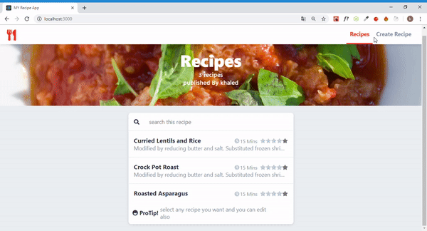
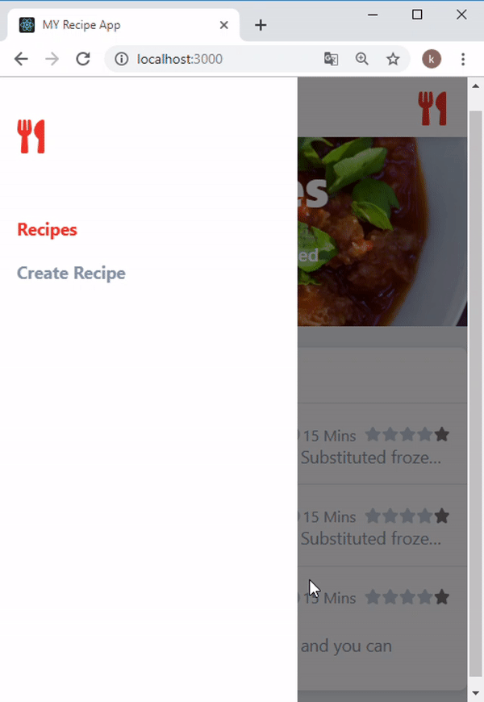
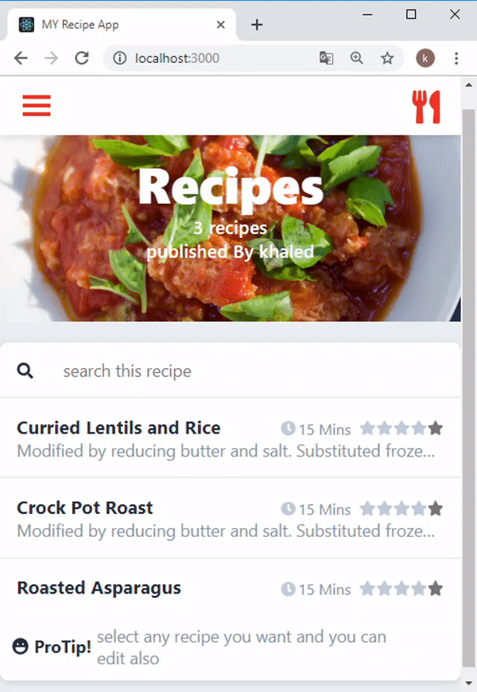
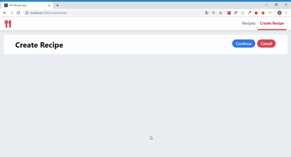
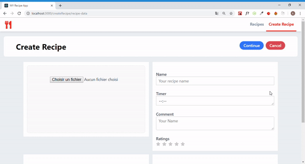
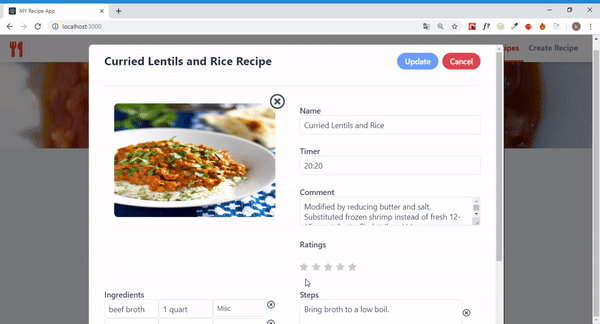
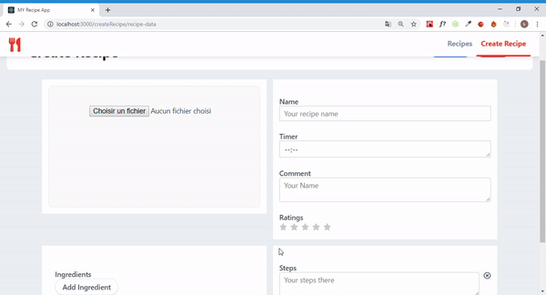

# Responsive Single Page Application was bootstrapped with Create React App. - Recipe App

## Frameworks and Libraries:

- React 16.8.4
- react-router-dom
- axios

## Providers:

- Using firebase as rest api
- Image preview and upload with firebase
- Nested forms
- CRUD
- Daynamic rating stars

## Tutorial

### Recipes page

### Create Recipe page

### Edit Recipe

## Development

`git clone https://github.com/khaledfarhati/react.js-spa-Recipe-App.git`

`npm install`

`npm run start`
